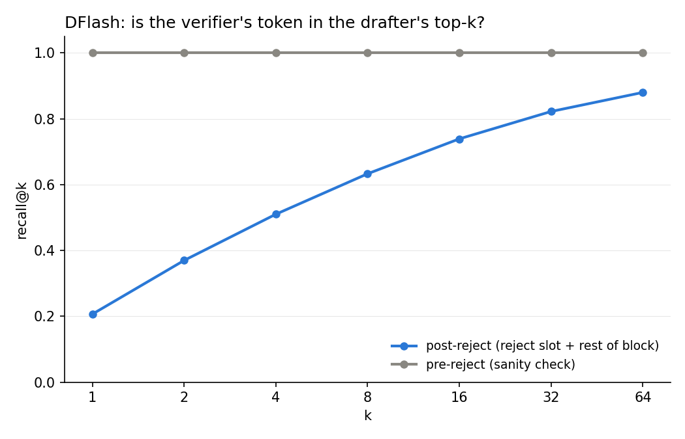
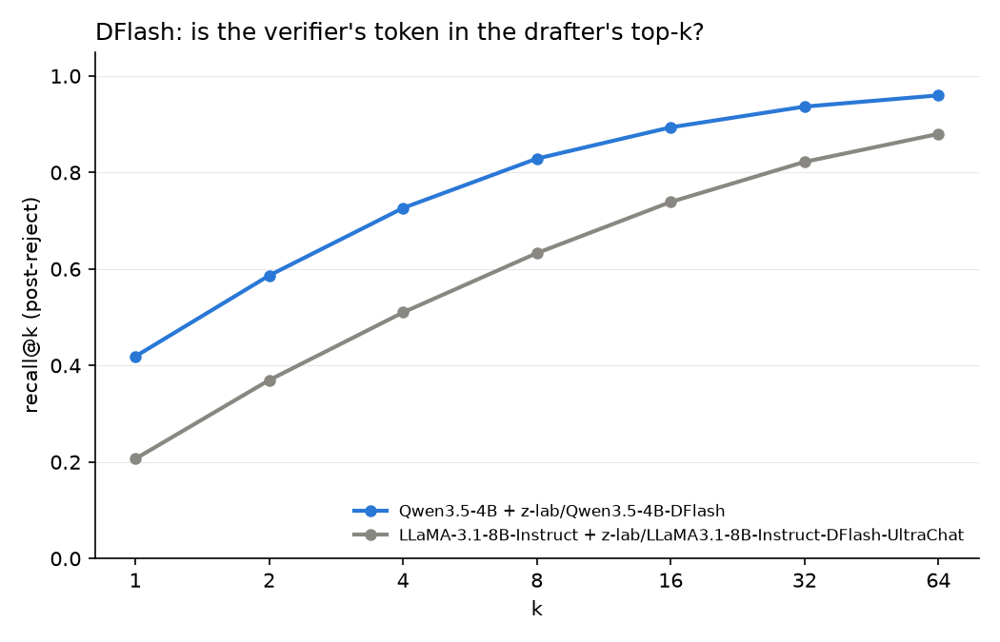

# DFlash drafter top-k recall

Does the DFlash (DLM/block-diffusion) drafter's top-k logits contain the
verifier's actual token even when its top-1 guess gets rejected?

## Hypothesis

xPress ("Parallel Refinement for Diffusion Drafters in Speculative Decoding")
reports that, for a DLM drafter, the verifier's token is frequently found
within the drafter's top-k even when it isn't the drafter's top-1 pick --
implying a reranking step over the drafter's own top-k could recover accepts
that plain top-1 sampling misses. This experiment measures that directly for
DFlash.

## Method

DFlash drafts a whole block of `gamma` candidate tokens per round. Rejection
of a position's top-1 guess only means that one candidate was wrong -- it
says nothing about whether the rest of the drafter's predicted distribution
at that position was any good. This experiment checks whether the
verifier's actual token lands inside the drafter's top-k regardless.

For every draft round we record the **rank** of the verifier's per-position
token within the drafter's own logit ordering at that position (rank 0 =
drafter's top-1), for **every** position in the block:

- **pre-reject** positions (before the round's first mismatch): trivially
  rank 0, since "accepted" means the drafter's top-1 already matched. Kept
  only as a sanity check.
- **post-reject** positions (the reject slot itself, plus everything drafted
  after it in the same block): the interesting case. If the verifier's
  token still shows up at low rank here, a reranking scheme could in
  principle have recovered it -- and, for positions past the reject slot,
  extended acceptance further into the block than a naive top-1 walk does.

`recall@k` = fraction of scored positions where the verifier's token has
rank < k, for k in {1, 2, 4, 8, 16, 32, 64}.

See `vendor/dflash/model.py`'s `dflash_generate(..., return_topk_recall=True)`
for the instrumented generation loop, and `scripts/analyze_dflash_topk_recall.py`
for how ranks get split into pre-/post-reject and turned into the recall@k
curve.

## Results (run: v1, MT-Bench, 80 prompts)



| k | recall@k (post-reject) | recall@k (pre-reject) |
|---|---|---|
| 1 | 0.207 | 1.000 |
| 2 | 0.370 | 1.000 |
| 4 | 0.510 | 1.000 |
| 8 | 0.633 | 1.000 |
| 16 | 0.739 | 1.000 |
| 32 | 0.822 | 1.000 |
| 64 | 0.880 | 1.000 |

n_post_reject = 34,250 positions, n_pre_reject = 14,026 positions.

Matches xPress's claim: even though only 20.7% of post-reject positions have
the verifier's token as the drafter's top-1 (that's what "rejected" means,
give or take the never-checked positions past the reject slot), 88.0% have
it somewhere in the top 64 -- out of a vocabulary of ~128k. Most rejections
are near-misses, not wild mispredictions.

## Results (run: qwen3.5-4b-v1, MT-Bench, 80 prompts)

Same methodology, rerun against a second, more recent target/drafter pair --
`Qwen/Qwen3.5-4B` + `z-lab/Qwen3.5-4B-DFlash` -- to check whether xPress's
claim holds outside the original LLaMA-3.1 setup. Qwen3.5-4B's hybrid
linear-attention/full-attention backbone needed a small fix to how the
target's KV-cache is rolled back after a rejected draft block (see
`vendor/dflash/model.py`'s `DynamicCache(config=...)` +
`activate_past_recording()` -- plain `DynamicCache()` can't be cropped back
for linear-attention layers without it).



| k | recall@k (post-reject), Qwen3.5-4B | recall@k (post-reject), LLaMA-3.1-8B (v1) |
|---|---|---|
| 1 | 0.419 | 0.207 |
| 2 | 0.587 | 0.370 |
| 4 | 0.726 | 0.510 |
| 8 | 0.829 | 0.633 |
| 16 | 0.894 | 0.739 |
| 32 | 0.937 | 0.822 |
| 64 | 0.960 | 0.880 |

n_post_reject = 26,795 positions, n_pre_reject = 21,400 positions.

Same qualitative pattern as v1, and containment is higher at every k --
Qwen3.5-4B's drafter's top-1 alone matches the verifier twice as often
(41.9% vs 20.7%), and by k=64 covers 96.0% of post-reject positions. Not a
controlled comparison (different model family, drafter size, and training
data), but it's further evidence the near-miss pattern xPress describes
isn't specific to one drafter/target pair. See "Reproducing" below for the
command.

## Future work

Containment alone doesn't buy speedup -- something has to actually surface
the right candidate out of the drafter's top-k and get it verified. Two
natural directions:

- **Reranking**: replace naive top-1 sampling with a reranking step over the
  drafter's own top-k, committing to a single, better-informed path per
  position before verification.
- **Draft tree**: instead of committing to one path, keep several top-k
  candidates explicit as branches (like EAGLE's dynamic draft tree) and
  verify multiple candidate continuations in parallel.

## Reproducing

```bash
python scripts/run_dflash_topk_recall.py --run-name v1
python scripts/analyze_dflash_topk_recall.py --run-name v1
# open results/v1/dflash_topk_recall_report.html (e.g. via VS Code preview)

# second target/drafter pair (see "Results (run: qwen3.5-4b-v1)" above)
python scripts/run_dflash_topk_recall.py --run-name qwen3.5-4b-v1 \
    --target-path Qwen/Qwen3.5-4B --dflash-checkpoint z-lab/Qwen3.5-4B-DFlash
python scripts/analyze_dflash_topk_recall.py --run-name qwen3.5-4b-v1
```

Target/drafter checkpoints are referenced by HF repo id and auto-download on
first run:

| run | target | DFlash drafter |
|---|---|---|
| v1 | `meta-llama/Llama-3.1-8B-Instruct` | `z-lab/LLaMA3.1-8B-Instruct-DFlash-UltraChat` |
| qwen3.5-4b-v1 | `Qwen/Qwen3.5-4B` | `z-lab/Qwen3.5-4B-DFlash` |

`data/mtbench_subset.jsonl` is a small MT-Bench prompt subset (prompts only,
no third-party generations).

## Caveats

- Only measures *containment* (is the right token somewhere in top-k), not
  whether a real, oracle-free reranking scheme could actually pick it out.
- Post-reject ranks past the immediate reject slot use the target's
  per-position judgment computed against the *as-drafted* block (same
  quantity DFlash's own verification already uses), not a re-verified token
  sequence conditioned on a hypothetically-corrected prefix -- this is the
  standard, cheap approximation for this kind of single-pass analysis, not a
  claim about what a full multi-branch reranker would actually see.

## Citation

```bibtex
@article{chen2026dflash,
  title={DFlash: Block Diffusion for Flash Speculative Decoding},
  author={Chen, Jian and Liang, Yesheng and Liu, Zhijian},
  journal={arXiv preprint arXiv:2602.06036},
  year={2026}
}
```

## Attribution / License

This directory's own content (scripts, README) is licensed under Apache
License 2.0 (see `LICENSE`). `vendor/dflash/` is DFlash's own code (MIT
license, see `vendor/dflash/LICENSE`), with a small instrumentation change
to `model.py` (`return_topk_recall` option) -- see `NOTICE`.
